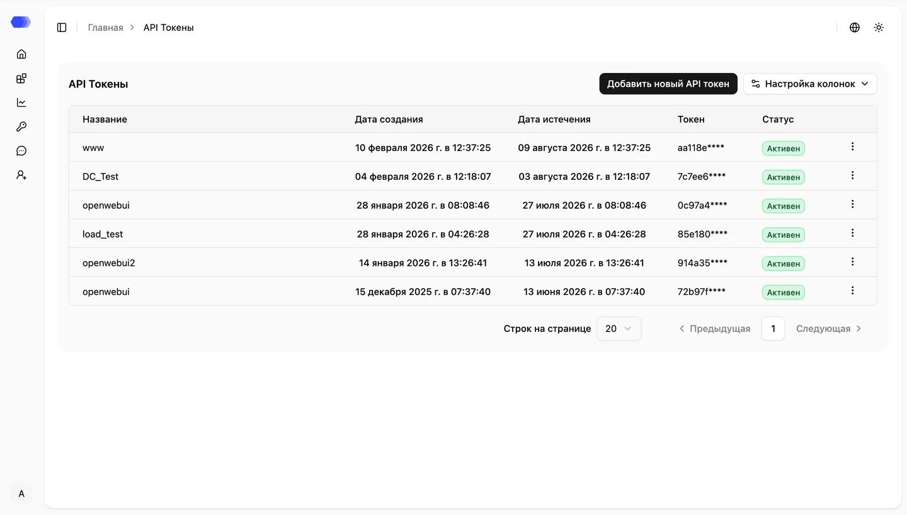

The **API Tokens** page is used to manage authorization tokens required for integrating with HiveTrace. In this section, you can view the list of created tokens, as well as create or delete tokens when needed.

## Creating an API Token

To generate a new token, click **“Add New API Token”** and provide a **name** for it. Once created, a window will display the token value.

> **Important:** the token is shown **only once**. Be sure to store it securely, as it cannot be viewed again.

The token is required for authentication when integrating with HiveTrace via the **SDK**, **API**, or **proxy**.
