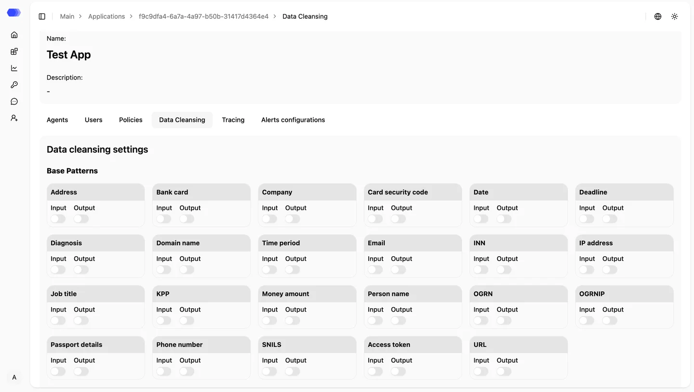
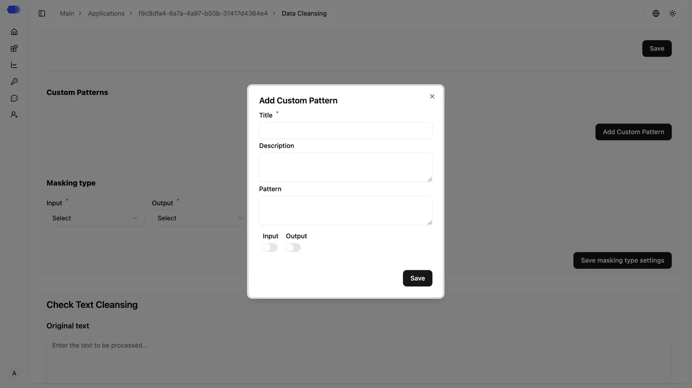
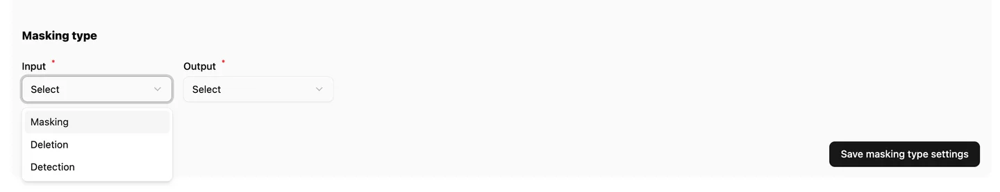
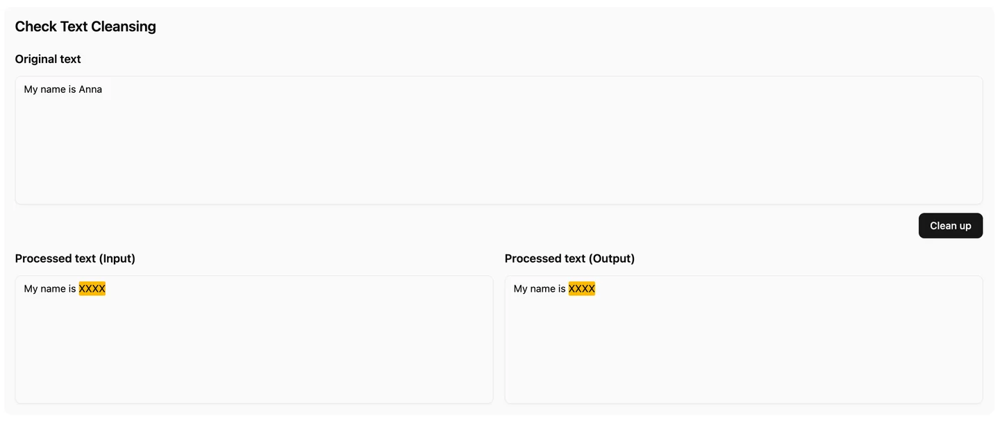
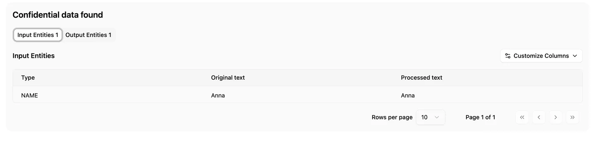

The **Personal Data Cleaning** section is used to configure rules for detecting and processing personal and sensitive data in user inputs and model outputs. This module helps reduce data leakage risks, ensure compliance with internal policies and regulations, and improve the overall security posture of AI applications.

## Built-in Patterns

HiveTrace includes a set of predefined patterns covering common types of personal data. These rules are enabled by default and require no additional configuration.

### Personal Data Categories

| Category        | Description                                 |
| --------------- | ------------------------------------------- |
| Address         | Mailing and physical addresses              |
| Bank Card       | Bank card numbers                           |
| Card Code       | CVV / CVC and other security codes          |
| Organization    | Company and organization names              |
| Job Title       | Professional titles and roles               |
| Names           | First and last names                        |
| Passport        | Passport details and document identifiers   |
| Phone           | Mobile and landline phone numbers           |
| Email           | Email addresses                             |
| IP Address      | IPv4 and IPv6 addresses                     |
| Domain Name     | Domain names and hosts                      |
| INN             | Taxpayer Identification Number              |
| KPP             | Tax Registration Reason Code                |
| OGRN            | Primary State Registration Number           |
| OGRNIP          | Individual Entrepreneur Registration Number |
| SNILS           | Personal insurance account number           |
| Monetary Amount | Financial amounts                           |
| Date            | Calendar dates                              |
| Period          | Time ranges and intervals                   |
| Deadline        | Due dates                                   |
| Diagnosis       | Medical diagnoses                           |
| Access Token    | API keys and access tokens                  |
| Link            | URLs and web links                          |

## Custom Patterns

You can define custom detection patterns using regular expressions. Scroll down and click **“Add Pattern”**, then provide a name, description, regex pattern, and select the scope — **input**, **output**, or both.

## Data Processing Types

For detected personal data, the following processing modes are available

| Processing Type | Description                                                                 |
| --------------- | --------------------------------------------------------------------------- |
| Masking         | Replaces detected data with an anonymized placeholder (for example, `XXXX`) |
| Detection       | Flags the presence of personal data without modifying the content           |
| Removal         | Completely removes detected data from the message                           |

Processing rules can be configured independently for **input** and **output**.

## Data Cleaning Validation

At the bottom of the page, a validation tool allows you to test how the data cleaning module processes messages containing personal data (or not) for both input and output based on the configured settings. This helps verify correctness before deploying the configuration to production.

