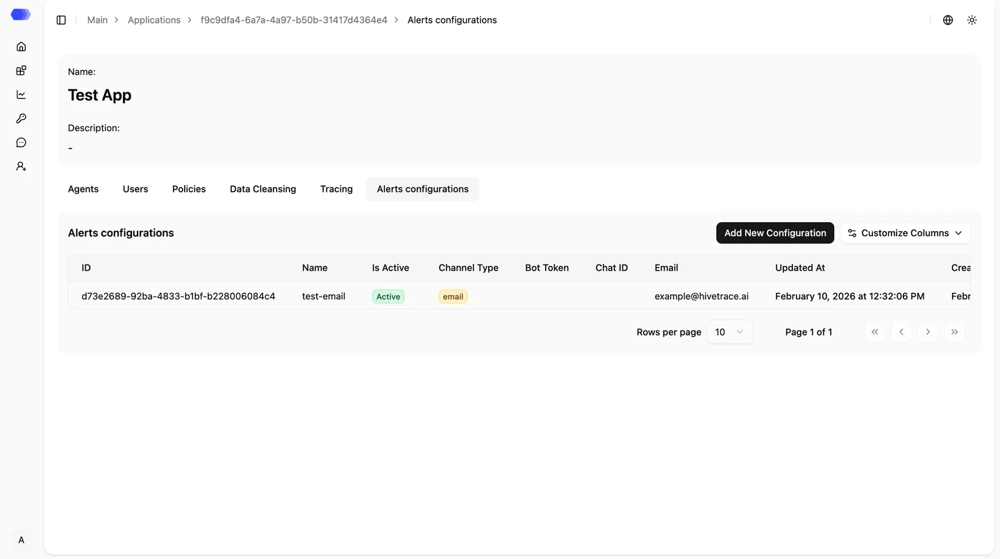

На странице **«Конфигурация оповещений»** вы можете просматривать существующие каналы уведомлений и добавлять новые. В настоящее время поддерживаются два способа доставки оповещений: **Email** и **Telegram**.

Все настроенные уведомления также отображаются в разделе **«Оповещения»**, обеспечивая централизованный доступ к информации о событиях и инцидентах.

> **Важно:** интеграция с SIEM-системой настраивается на этапе развертывания платформы вашим DevOps-инженером или специалистом HiveTrace. Поддерживаемый формат передачи логов — **Syslog**.

## Добавление новой конфигурации

Чтобы создать новый канал уведомлений, нажмите **«Добавить новую конфигурацию»** и заполните необходимые поля в зависимости от выбранного типа.

**Для Email:**

- **Название** — произвольное имя конфигурации;
- **Email** — адрес для получения уведомлений.

**Для Telegram:**

- **Название** — имя конфигурации;
- **Токен бота** — токен, полученный при создании Telegram-бота;
- **ID чата** — идентификатор чата или канала для отправки уведомлений.

Корректно настроенные оповещения помогают оперативно реагировать на инциденты, контролировать состояние AI-приложений и поддерживать требуемый уровень безопасности.
