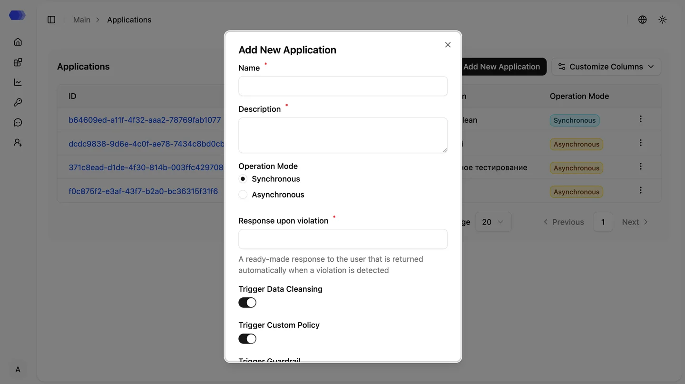

## Регистрация приложения в системе HiveTrace

Перейдите в раздел «Приложения», нажмите «Добавить новое приложение» и заполните обязательные поля.

### Для синхронного режима:

- Название — укажите наименование приложения.
- Описание — добавьте краткую информацию о его назначении.
- Ответ при нарушении — готовое сообщение, которое автоматически возвращается пользователю при обнаружении нарушения.
- Область применения блокирования — выберите, к каким типам политик будет применяться блокировка:
  - Data Clean — правила очистки и защиты данных.
  - Guardrail — встроенные механизмы защиты от prompt-инъекций и jailbreak-атак.
  - Custom — пользовательские политики безопасности.

### Для асинхронного режима:

- Название
- Описание

После регистрации приложение появится в системе HiveTrace. Вы сможете использовать App ID для интеграции с платформой, а также управлять настройками политик безопасности — для этого откройте карточку приложения, нажав на соответствующий App ID.

## Настройки приложения и управление

После открытия карточки приложения становятся доступны параметры политик безопасности, правил мониторинга, а также сведения о пользователях и работе мультиагентных систем. Эти инструменты позволяют централизованно управлять защитой приложения и контролировать взаимодействия с AI-моделями.

### Основные разделы

- Агенты — отображает агентов, используемых в мультиагентных системах, включая агентов, добавленных автоматически или переданных вручную через SDK.
- Пользователи — содержит список пользователей вашего приложения, взаимодействующих с AI-сервисом (например, пользователи чат-бота).
- Политики — позволяет управлять встроенными политиками Guardrail, настраивать пользовательские (Custom) правила и задавать пороги потребления токенов. При превышении установленных значений система формирует оповещения с уровнями критичности low, high и critical.
- Очистка персональных данных — предоставляет инструменты для настройки паттернов обнаружения чувствительной информации и выбора способов ее маскирования.
- Трассировка — визуализирует выполнение мультиагентных сценариев в виде графа с детализацией вызовов агентов и инструментов, упрощая анализ цепочек взаимодействий.
- Конфигурация оповещений — позволяет определить каналы доставки уведомлений, например электронную почту или Telegram. Интеграция с SIEM-системами настраивается на этапе развертывания командой HiveTrace или ответственным DevOps-инженером.
