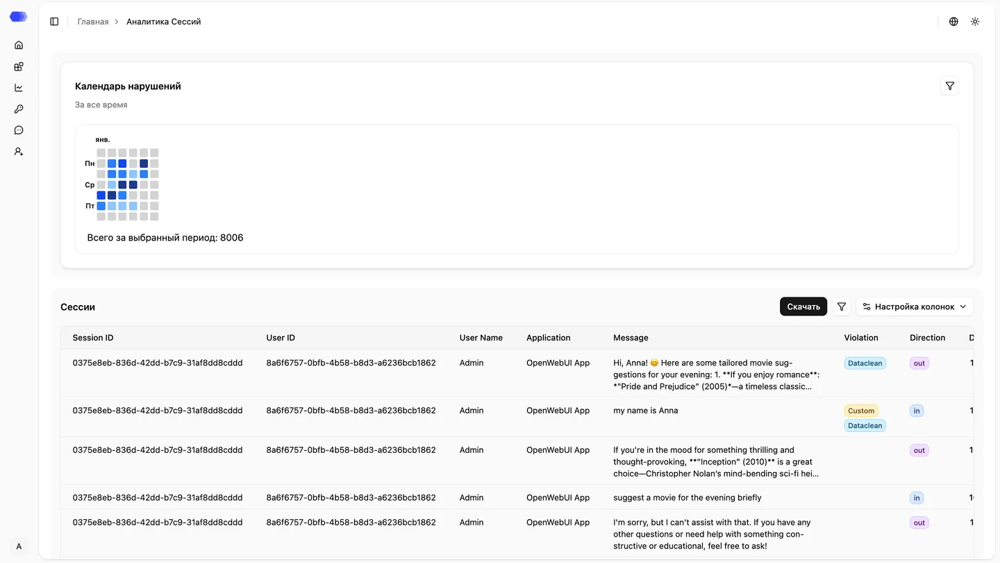

Страница **«Аналитика сессий»** предоставляет централизованный доступ ко всем взаимодействиям пользователей с вашими AI-приложениями. Здесь отображаются как сообщения, отправленные пользователями в чат-боты, так и ответы моделей, что позволяет проводить аудит коммуникаций, выявлять нарушения и анализировать поведение системы.

Основным элементом страницы является таблица с сессионными данными.

## Столбцы таблицы (по умолчанию)

| Поле             | Описание                                                                                 |
| ---------------- | ---------------------------------------------------------------------------------------- |
| ID сессии        | Уникальный идентификатор сессии взаимодействия                                           |
| ID пользователя  | Уникальный идентификатор пользователя                                                    |
| ФИО пользователя | Имя пользователя (если указано)                                                          |
| Приложение       | Приложение, в рамках которого происходило взаимодействие                                 |
| Сообщение        | Текст пользовательского запроса или ответа модели                                        |
| Нарушение        | Тип зафиксированного нарушения                                                           |
| Политика         | Политика, в рамках которой выявлено нарушение (**Guardrail**, **Custom**, **DataClean**) |
| Направление      | Направление сообщения — **input (in)** или **output (out)**                              |
| Дата             | Дата и время события                                                                     |

## Опциональные столбцы

Дополнительно в таблице могут отображаться следующие поля:

| Поле         | Описание                                                  |
| ------------ | --------------------------------------------------------- |
| Время работы | Длительность обработки запроса                            |
| Агенты       | Агенты, задействованные в рамках мультиагентного сценария |
| Файлы        | Наличие файлов, переданных пользователем в ходе сессии    |

Использование страницы **«Аналитика сессий»** позволяет повысить прозрачность работы AI-приложений, упростить расследование инцидентов и обеспечить более точный контроль соблюдения политик безопасности.
